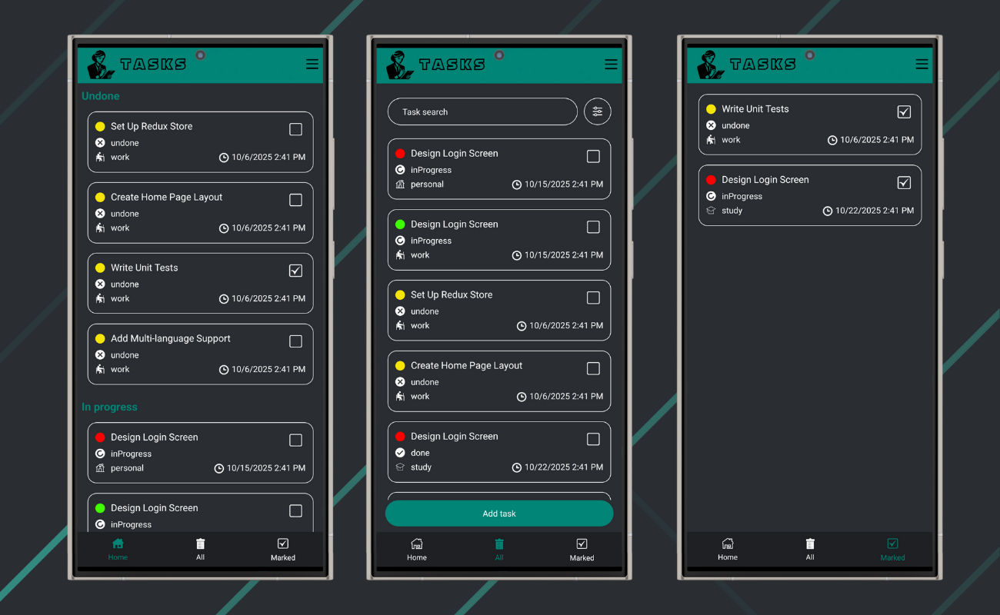

# Individual project: tasks

### Description:

**Tasks** is a mobile application for personal task management, designed to make planning and organization simple, efficient, and visually clear.  
Users can register, create their own tasks, edit or delete them, and customize the app’s appearance and behavior to fit their preferences.  
All user data is stored securely in **Firebase**, while global state is managed using **Redux Toolkit**.

---

### Features:

1. **User Interface:**

   - Minimalistic and user-friendly design.
   - Intuitive navigation between screens.
   - Home page widgets showing selected task categories.
   - Drawer menu with quick access to settings and filters.

2. **Authentication:**

   - User registration and login via **Firebase Authentication**.
   - Secure storage of user data in **Firebase Realtime Database**.
   - Automatic session recovery after app restart.

3. **Task Management:**

   - Create new tasks with detailed parameters:
     - **Title**
     - **Description**
     - **Type**
     - **Category**
     - **Deadline**
     - **Priority**
   - Edit, update, or delete tasks anytime.

4. **Widgets and Filters:**

   - Configure widgets in the Drawer menu to display specific categories on the Home screen.
   - Advanced **filter system** for sorting tasks by category, type, priority, or deadline.
   - User preferences are automatically saved for future sessions.

5. **Customization:**

   - Light and dark mode themes.
   - Language selection (English / Ukrainian).
   - Flexible customization of app appearance.
   - All settings are saved locally using **Redux Persist**.

6. **Performance and UX:**

   - Built-in **loader** to visually indicate loading states.
   - Smooth animations and optimized performance even with large data sets.
   - Responsive interface for various screen sizes.

---

### Stages of Implementation:

1. **Interface Design:**

   - Creating screen layouts, choosing colors and fonts, building navigation and the drawer menu.

2. **Functionality Development:**

   - Implementing task creation, editing, deletion, and filtering logic.
   - Integrating Firebase Authentication and Realtime Database.

3. **State Management:**

   - Setting up **Redux Toolkit** for managing tasks, user data, and app settings.

4. **Testing:**

   - Conducting tests to ensure app stability and smooth operation on Android devices.
   - Verifying persistence of data and settings after restart.

5. **Release:**

   - Building a release APK and publishing the project on GitHub.

---

### Advantages of Using:

- Organized task management.
- Flexible interface customization.
- Convenient deadline control.
- Data synchronization via Firebase.
- Smooth user experience with loading indicators and animations.

---

### Technologies Used:

1. **Languages:**

   - **TypeScript**
   - **CSS**

2. **Frameworks & Libraries:**

   - **React Native**
   - **Redux Toolkit**
   - **React Navigation**

3. **Backend / Database:**

   - **Firebase Authentication**
   - **Firebase Realtime Database**

4. **Storage:**

   - **Redux Persist**

5. **Version Control:**

   - **Git & GitHub**

6. **Design & Responsiveness:**
   - **Flexbox**
   - **React Native Stylesheet**

---

**Tasks App** — a convenient and customizable mobile solution for managing your daily and work-related tasks.  
It helps you stay organized, motivated, and productive every day.
